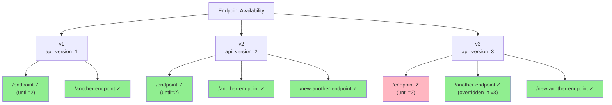

# Simple Versioning Example

!!! warning "The English documentation has been automatically translated. If you notice any grammatical or semantic errors, please help improve it by contributing corrections on [GitHub](https://github.com/feodor-ra/fastapi-easy-versioning), or refer to the original Russian documentation."

The example is available on [GitHub](https://github.com/feodor-ra/fastapi-easy-versioning/blob/master/examples/simple_versioning.py).

To run it locally, clone the repository and execute the following command:

```bash
git clone https://github.com/feodor-ra/fastapi-easy-versioning.git
```

```bash
uvx --python=3.13 --from="fastapi[standard]" --with="fastapi-easy-versioning" fastapi dev fastapi-easy-versioning/examples/simple_versioning.py
```

The example contains the following code:

```python
from typing import Annotated

from fastapi import Depends, FastAPI, middleware
from fastapi_easy_versioning import (
    VersioningMiddleware,
    VersioningSupport,
    versioning,
)

app = FastAPI(middleware=[middleware.Middleware(VersioningMiddleware)])
app_v1 = FastAPI(api_version=1)
app_v2 = FastAPI(api_version=2)
app_v3 = FastAPI(api_version=3)

app.mount("/v1", app_v1)
app.mount("/v2", app_v2)
app.mount("/v3", app_v3)


@app_v1.get("/endpoint", dependencies=[Depends(versioning(until=2))])
def endpoint() -> str:
    return "I'm v1 endpoint"


@app_v1.get("/another-endpoint")
def another_endpoint(
    version: Annotated[VersioningSupport, Depends(versioning())],
) -> str:
    return f"I'm v{version.origin} another endpoint"


@app_v2.get("/new-another-endpoint", dependencies=[Depends(versioning())])
def new_another_endpoint() -> str:
    return "I'm v2 new another endpoint"


@app_v3.get("/another-endpoint", dependencies=[Depends(versioning())])
def overload_another_endpoint() -> str:
    return "I'm v3 overloaded another endpoint"
```

This code creates three API versions (v1, v2, v3), with Swagger documentation available at:

- <http://127.0.0.1:8000/v1/docs>
- <http://127.0.0.1:8000/v2/docs>
- <http://127.0.0.1:8000/v3/docs>

The resulting structure is as follows:

- The first version includes two endpoints:
  - `/endpoint`, available in versions v1 and v2 (with `until=2` restriction)
  - `/another-endpoint`, available across all versions (v1, v2, and v3)

- The second version introduces a new endpoint `/new-another-endpoint`, available in all versions starting from v2 (v2 and v3)

- The third version adds an endpoint `/another-endpoint` that overrides the same-named endpoint from the first version and will be available in all subsequent versions


