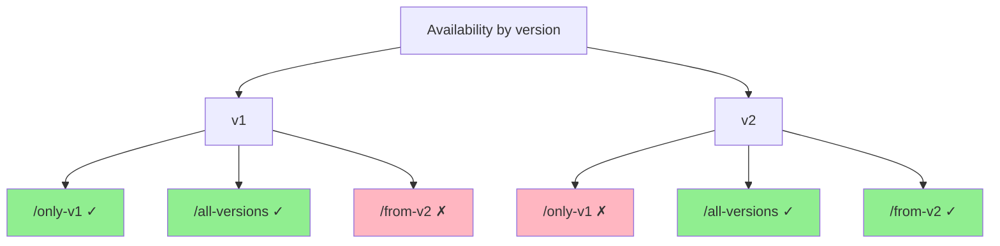

# FastAPI Easy Versioning


[](https://coveralls.io/github/feodor-ra/fastapi-easy-versioning?branch=master)
[](https://feodor-ra.github.io/fastapi-easy-versioning/)

!!! warning "The English documentation has been automatically translated. If you notice any grammatical or semantic errors, please help improve it by contributing corrections on [GitHub](https://github.com/feodor-ra/fastapi-easy-versioning), or refer to the original Russian documentation."

This is a solution for building versioned APIs automatically using [FastAPI](https://fastapi.tiangolo.com). It enables automatic inheritance of endpoints from previous FastAPI sub-applications into newer versions based on configuration, and correctly reflects them in the OpenAPI schema.

## Installation

```bash
pip install fastapi-easy-versioning
```

[PyPI](https://pypi.org/project/fastapi-easy-versioning/)

## Usage

To implement versioning, use the `VersioningMiddleware` and the dependency factory `versioning`.

Example:

```python
from fastapi import FastAPI, Depends
from fastapi_easy_versioning import VersioningMiddleware, versioning

app = FastAPI()
app_v1 = FastAPI(api_version=1)
app_v2 = FastAPI(api_version=2)

app.mount("/v1", app_v1)
app.mount("/v2", app_v2)
app.add_middleware(VersioningMiddleware)

@app_v1.get('/only-v1', dependencies=[Depends(versioning(until=1))])
def only_v1() -> str:
    return "Available only in version v1"

@app_v1.get('/all-versions', dependencies=[Depends(versioning())])
def all_versions() -> str:
    return "Available in all versions starting from v1"

@app_v2.get('/from-v2', dependencies=[Depends(versioning())])
def from_v2() -> str:
    return "Available starting from v2 and in all future versions"
```



The endpoint `/only-v1` is available only in version `v1` at `/v1/only-v1`.
The endpoint `/from-v2` becomes available starting from version `v2` at `/v2/from-v2` and is automatically inherited in all subsequent versions.
The endpoint `/all-versions`, defined in `v1`, is accessible at both `/v1/all-versions` and `/v2/all-versions` due to the inheritance mechanism.

Using the `versioning` dependency factory, you can specify the last version in which an endpoint remains available by setting the `until` parameter to a version number. If `until` is set to `None` or omitted, the endpoint will be available in the version it was declared and in all later versions.

To associate a sub-application with a specific version, use the `api_version` parameter when creating the `FastAPI` instance. It must be an integer. Sub-applications without the `api_version` parameter will be ignored during versioning processing.

More examples are available in the **examples** section.
