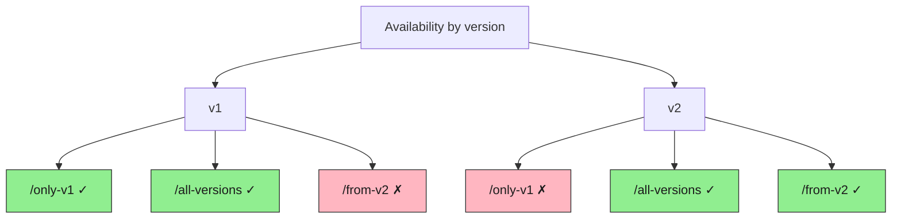

# fastapi-easy-versioning

**Versioned APIs for FastAPI.** One sub-application per version, automatic inheritance of endpoints from older versions into newer ones, and an up-to-date OpenAPI schema for every version.

---

## Why

Once an API lives in several versions, routes have to be copied between them by hand: `/v2` must serve everything `/v1` served, minus what was deliberately dropped. The copies drift apart, `/v1/docs` and `/v2/docs` start lying, and "which versions is this endpoint even in?" becomes a question for `git blame`.

`fastapi-easy-versioning` makes the availability range a **property of the endpoint**: declare it once, mark it with a dependency, and it shows up in every later version by itself.

=== "Before"

    ```python
    app_v1 = FastAPI()
    app_v2 = FastAPI()


    @app_v1.get("/items")
    def items_v1() -> list[Item]:  # (1)!
        return get_items()


    @app_v2.get("/items")
    def items_v2() -> list[Item]:
        return get_items()
    ```

    1. The same endpoint, duplicated by hand. Every new version adds another copy, and one day one of them will be left un-updated.

=== "After"

    ```python
    app = FastAPI()
    app.add_middleware(VersioningMiddleware)
    app.mount("/v1", app_v1)
    app.mount("/v2", app_v2)


    @app_v1.get("/items", dependencies=[Depends(versioning())])  # (1)!
    def items() -> list[Item]:
        return get_items()
    ```

    1. Declared once in v1 — and available in v2 and every future version. The `/v2/docs` schema builds itself.

=== "…with a limit"

    ```python
    @app_v1.get("/legacy", dependencies=[Depends(versioning(until=2))])  # (1)!
    def legacy() -> str:
        return "gone after v2"
    ```

    1. Available in v1 and v2, absent from v3 — at runtime and in the schema alike. See [the `until` semantics](guide/dependency.md#until).

Every version stays an ordinary FastAPI application: its own routing, its own `/docs`, its own `dependency_overrides`.


```mermaid
graph TD
    A[Availability by version]
    A --> B[v1]
    A --> C[v2]

    B --> B1["/only-v1 ✓"]:::available
    B --> B2["/all-versions ✓"]:::available
    B --> B3["/from-v2 ✗"]:::missing

    C --> C1["/only-v1 ✗"]:::missing
    C --> C2["/all-versions ✓"]:::available
    C --> C3["/from-v2 ✓"]:::available

    classDef available fill:#90EE90,stroke:#333,color:#1b1b1b
    classDef missing fill:#FFB6C1,stroke:#333,color:#1b1b1b
```

## Features

<div class="grid cards" markdown>

-   :material-source-branch: **Inheritance between versions**

    ---

    An endpoint is declared once and lands in every later version on its own. Each version gets its own copy of the route.

    [:octicons-arrow-right-24: Middleware](guide/middleware.md)

-   :material-ray-end: **An exact availability range**

    ---

    `until` sets the last version an endpoint is available in. Without it — "through the latest version", including ones that do not exist yet.

    [:octicons-arrow-right-24: until semantics](guide/dependency.md#until)

-   :material-layers-triple: **Redefinition shadows**

    ---

    An endpoint of your own on the same path in a newer version shadows the inherited one — at runtime and in OpenAPI.

    [:octicons-arrow-right-24: Inheritance rules](guide/middleware.md#inheritance)

-   :material-file-document-check: **An honest `/docs` per version**

    ---

    After inheritance every version's OpenAPI schema is regenerated, so Swagger shows exactly what that version serves.

    [:octicons-arrow-right-24: OpenAPI](guide/middleware.md#openapi)

-   :material-transit-connection-variant: **HTTP and WebSocket**

    ---

    `APIRoute` and `APIWebSocketRoute` are versioned alike; the version metadata is readable right inside the endpoint.

    [:octicons-arrow-right-24: Dependency](guide/dependency.md)

-   :material-set-split: **Several independent APIs**

    ---

    Public and private APIs in one application version separately — one middleware per aggregating application.

    [:octicons-arrow-right-24: Example](examples/multiple.md)

</div>

## Install

=== "uv"

    ```bash
    uv add fastapi-easy-versioning
    ```

=== "pip"

    ```bash
    pip install fastapi-easy-versioning
    ```

!!! info "Requirements"

    - Python **3.10+**
    - FastAPI **≥ 0.95** (`0.137.0` and `0.137.1` are excluded — see [Limitations](guide/limitations.md#fastapi))
    - Nothing else: `fastapi` is the only runtime dependency

## Next

<div class="grid cards" markdown>

-   :material-rocket-launch: **[Quickstart](quickstart.md)** — a working app in a minute.
-   :material-book-open-variant: **[Guide](guide/dependency.md)** — dependency, middleware, recipes, limitations.
-   :material-code-tags: **[Examples](examples/simple.md)** — runnable apps from the repository.
-   :material-api: **[API Reference](reference/dependency.md)** — signatures from the docstrings.

</div>
