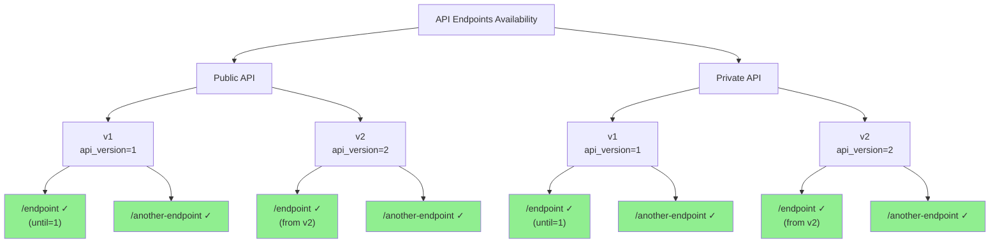

# Пример версионирования нескольких API

Пример представлен в [GitHub](https://github.com/feodor-ra/fastapi-easy-versioning/blob/master/examples/multiple_versioning.py).

Для локального запуска необходимо склонировать репозиторий и выполнить следующую команду:

```bash
git clone https://github.com/feodor-ra/fastapi-easy-versioning.git
```

```bash
uvx --python=3.13 --from="fastapi[standard]" --with="fastapi-easy-versioning" fastapi dev fastapi-easy-versioning/examples/multiple_versioning.py
```

Пример содержит следующий код:

```python
from fastapi import Depends, FastAPI, middleware
from fastapi_easy_versioning import (
    VersioningMiddleware,
    versioning,
)

app = FastAPI()

public_app = FastAPI(middleware=[middleware.Middleware(VersioningMiddleware)])
public_v1 = FastAPI(api_version=1)
public_v2 = FastAPI(api_version=2)

private_app = FastAPI(middleware=[middleware.Middleware(VersioningMiddleware)])
private_v1 = FastAPI(api_version=1)
private_v2 = FastAPI(api_version=2)

app.mount("/api/public", public_app)
public_app.mount("/v1", public_v1)
public_app.mount("/v2", public_v2)

app.mount("/api/private", private_app)
private_app.mount("/v1", private_v1)
private_app.mount("/v2", private_v2)


@private_v1.get("/endpoint", dependencies=[Depends(versioning(until=1))])
def private_endpoint() -> str:
    return "I'm v1 private endpoint"


@private_v1.get("/another-endpoint", dependencies=[Depends(versioning())])
def private_another_endpoint() -> str:
    return "I'm v1 private another endpoint"


@private_v2.get("/endpoint", dependencies=[Depends(versioning())])
def private_endpoint_v2() -> str:
    return "I'm v2 private endpoint"


@public_v1.get("/endpoint", dependencies=[Depends(versioning(until=1))])
def public_endpoint() -> str:
    return "I'm v1 public endpoint"


@public_v1.get("/another-endpoint", dependencies=[Depends(versioning())])
def public_another_endpoint() -> str:
    return "I'm v1 public another endpoint"


@public_v2.get("/endpoint", dependencies=[Depends(versioning())])
def public_endpoint_v2() -> str:
    return "I'm v2 public endpoint"
```

Этот код создает два независимых версионированных API: public и private. Каждое из них имеет две версии (v1 и v2). Документация Swagger для них доступна по следующим ссылкам:

- Public API v1: <http://127.0.0.1:8000/api/public/v1/docs>
- Public API v2: <http://127.0.0.1:8000/api/public/v2/docs>
- Private API v1: <http://127.0.0.1:8000/api/private/v1/docs>
- Private API v2: <http://127.0.0.1:8000/api/private/v2/docs>

В результате получается следующая структура:

- В public API:
  - `/endpoint` доступен только в версии v1 (ограничение `until=1`)
  - `/another-endpoint` доступен во всех версиях (начиная с v1)
  - во v2 добавляется новый эндпоинт `/endpoint`, который перекрывает версию из v1

- В private API:
  - `/endpoint` доступен только в версии v1 (ограничение `until=1`)
  - `/another-endpoint` доступен во всех версиях (начиная с v1)
  - во v2 добавляется новый эндпоинт `/endpoint`, который перекрывает версию из v1

Оба API работают независимо друг от друга благодаря использованию отдельных экземпляров `VersioningMiddleware`.


