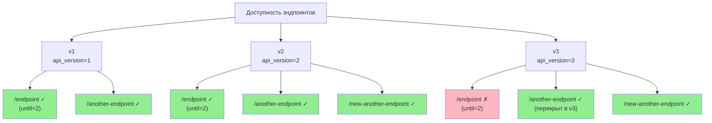

# Пример простого версионирования

Пример представлен в [GitHub](https://github.com/feodor-ra/fastapi-easy-versioning/blob/master/examples/simple_versioning.py).

Для локального запуска необходимо склонировать репозиторий и выполнить следующую команду:

```bash
git clone https://github.com/feodor-ra/fastapi-easy-versioning.git
```

```bash
uvx --python=3.13 --from="fastapi[standard]" --with="fastapi-easy-versioning" fastapi dev fastapi-easy-versioning/examples/simple_versioning.py
```

Пример содержит следующий код:

```python
from typing import Annotated

from fastapi import Depends, FastAPI, middleware
from fastapi_easy_versioning import (
    VersioningMiddleware,
    VersioningSupport,
    versioning,
)

app = FastAPI(middleware=[middleware.Middleware(VersioningMiddleware)])
app_v1 = FastAPI(api_version=1)
app_v2 = FastAPI(api_version=2)
app_v3 = FastAPI(api_version=3)

app.mount("/v1", app_v1)
app.mount("/v2", app_v2)
app.mount("/v3", app_v3)


@app_v1.get("/endpoint", dependencies=[Depends(versioning(until=2))])
def endpoint() -> str:
    return "I'm v1 endpoint"


@app_v1.get("/another-endpoint")
def another_endpoint(
    version: Annotated[VersioningSupport, Depends(versioning())],
) -> str:
    return f"I'm v{version.origin} another endpoint"


@app_v2.get("/new-another-endpoint", dependencies=[Depends(versioning())])
def new_another_endpoint() -> str:
    return "I'm v2 new another endpoint"


@app_v3.get("/another-endpoint", dependencies=[Depends(versioning())])
def overload_another_endpoint() -> str:
    return "I'm v3 overloaded another endpoint"
```

Этот код создает три версии API (v1, v2, v3), документация Swagger для которых доступна по следующим ссылкам:

- <http://127.0.0.1:8000/v1/docs>
- <http://127.0.0.1:8000/v2/docs>
- <http://127.0.0.1:8000/v3/docs>

В результате получается следующая структура:

- В первой версии добавляются два эндпоинта:
  - `/endpoint`, который будет доступен в версиях v1 и v2 (указано ограничение `until=2`)
  - `/another-endpoint`, который доступен во всех версиях (v1, v2 и v3)

- Во второй версии добавляется новый эндпоинт `/new-another-endpoint`, который будет доступен во всех версиях, начиная с v2 (v2 и v3)

- В третьей версии добавляется эндпоинт `/another-endpoint`, который заменяет одноименный эндпоинт из первой версии и будет доступен во всех последующих версиях


