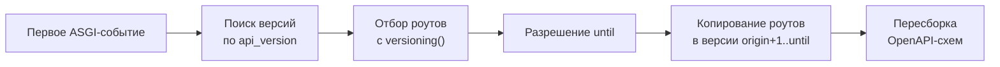

# Middleware

`VersioningMiddleware` выполняет основную работу версионирования: находит версионные субприложения, наследует помеченные эндпоинты из старых версий в новые и перестраивает OpenAPI-схему каждой версии.

## Куда добавлять

Middleware добавляется только в приложение, которое **непосредственно монтирует** версионные субприложения, — не в сами версии.

```python
from fastapi import FastAPI
from fastapi_easy_versioning import VersioningMiddleware

app = FastAPI()
app_v1 = FastAPI(api_version=1)
app_v2 = FastAPI(api_version=2)

app.mount("/v1", app_v1)
app.mount("/v2", app_v2)
app.add_middleware(VersioningMiddleware)
```

Если нужно два и более изолированных версионированных API, добавьте отдельный `VersioningMiddleware` в каждое агрегирующее приложение — каждый экземпляр версионирует только субприложения, смонтированные непосредственно под его приложением:

```python
from fastapi import FastAPI, middleware
from fastapi_easy_versioning import VersioningMiddleware

app = FastAPI()

public_app = FastAPI(middleware=[middleware.Middleware(VersioningMiddleware)])
public_v1 = FastAPI(api_version=1)
public_v2 = FastAPI(api_version=2)

private_app = FastAPI(middleware=[middleware.Middleware(VersioningMiddleware)])
private_v1 = FastAPI(api_version=1)
private_v2 = FastAPI(api_version=2)

app.mount("/api/public", public_app)
public_app.mount("/v1", public_v1)
public_app.mount("/v2", public_v2)

app.mount("/api/private", private_app)
private_app.mount("/v1", private_v1)
private_app.mount("/v2", private_v2)
```

Нумерация версий у таких API независима: `public_v1` и `private_v1` — разные наборы, они не наследуют друг у друга. Развёрнутый разбор — в [примере](../examples/multiple.md).

## Настройка приложений-версий { #api-version }

Middleware определяет, какие FastAPI-приложения участвуют в версионировании, по extra-параметру `api_version` (константа `API_VERSION_KEY`):

- `api_version` должен быть целым числом; версия `0` допустима.
- Субприложение без `api_version` игнорируется: в него не наследуются эндпоинты и из него не берутся, даже если они помечены зависимостью `versioning()`.
- `api_version` неверного типа (`"1"`, `True`, `1.0`) — субприложение игнорируется, при этом выдаётся `UserWarning`, чтобы опечатка не осталась незамеченной.

```python
app_v1 = FastAPI(api_version=1)   # участвует в версионировании
internal = FastAPI()              # игнорируется
```

!!! note "`bool` — не `int`"

    Несмотря на то что в Python `True == 1`, `api_version=True` считается ошибкой типа: слишком велика вероятность, что это опечатка, а не намеренный номер версии.

## Как работает наследование { #inheritance }

Наследование строится **один раз** — при первом ASGI-событии. Под реальным сервером (uvicorn) это событие запуска lifespan; при монтировании внутрь другого приложения или в тестах — первый запрос. Последующие запросы никакой дополнительной работы не выполняют.



Правила:

- Наследуются только эндпоинты, помеченные `versioning()`, в диапазоне от версии объявления до `until` включительно.
- Каждая наследующая версия получает **собственную копию** роута: изменение роута в одной версии не затрагивает другие, а `dependency_overrides` разрешаются приложением той версии, которая обслуживает запрос.
- Если в новой версии объявлен собственный эндпоинт с тем же путём и методами, наследование в неё пропускается — новая версия **затеняет** старую и в рантайме, и в OpenAPI-схеме.
- Версионируются и HTTP-эндпоинты (`APIRoute`), и WebSocket-эндпоинты (`APIWebSocketRoute`) — с одинаковой семантикой. Затенение видозависимое: HTTP-эндпоинт и WebSocket на одном пути не мешают друг другу.

!!! warning "Нюанс fastapi 0.95"

    У WebSocket-роутов там ещё нет параметра `dependencies`, поэтому пометить их версионированием можно только зависимостью в сигнатуре эндпоинта. Подробнее в [Ограничениях](limitations.md#websocket).

## OpenAPI { #openapi }

После наследования middleware перестраивает OpenAPI-схему каждой версии, поэтому `/docs` каждой версии показывает и собственные, и унаследованные эндпоинты.

Перестройку можно отключить параметром `rebuild_openapi`. Эндпоинты по-прежнему наследуются и обслуживаются, но унаследованные не появятся в схеме и `/docs` соответствующей версии:

```python
from fastapi import FastAPI, middleware
from fastapi_easy_versioning import VersioningMiddleware

app = FastAPI(
    middleware=[middleware.Middleware(VersioningMiddleware, rebuild_openapi=False)]
)

# или

app = FastAPI()
app.add_middleware(VersioningMiddleware, rebuild_openapi=False)
```

## Добавление эндпоинтов во время работы { #runtime }

Версионированный эндпоинт или новая версия, добавленные после первого запроса, автоматически подхвачены не будут. Для этого предназначена публичная функция `rebuild_versioning`: она заново строит наследование и обновляет OpenAPI-схемы версий. Вызов идемпотентен, а `until`, заданный по умолчанию, пересчитывается относительно новой последней версии.

```python
from fastapi_easy_versioning import rebuild_versioning

# после добавления роутов или монтирования новой версии в рантайме
rebuild_versioning(app)  # app — приложение, монтирующее версии
```

## Совместимость с FastAPI

Кратко: поддерживаются `0.95` и новее, кроме `0.137.0` и `0.137.1`. Разбор причин и матрица режимов — в [Ограничениях](limitations.md#fastapi).

!!! tip "Полный справочник"

    Сигнатуры и подробное описание — в [справочнике API](../reference/middleware.md).
