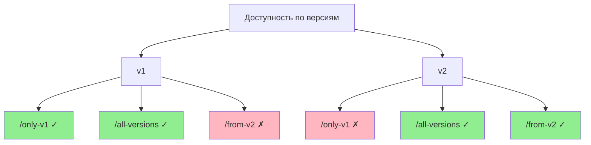

# FastAPI Easy Versioning


[](https://coveralls.io/github/feodor-ra/fastapi-easy-versioning?branch=master)
[](https://feodor-ra.github.io/fastapi-easy-versioning/)

Это решение для автоматического построения версионированного API с использованием [FastAPI](https://fastapi.tiangolo.com), которое позволяет автоматически наследовать эндпоинты из предыдущих версий субприложений в последующие, на основе заданных параметров, а также корректно отражает их в OpenAPI-схеме.

## Установка

```bash
pip install fastapi-easy-versioning
```

[PyPI](https://pypi.org/project/fastapi-easy-versioning/)

## Использование

Для работы с версионированием необходимо использовать middleware `VersioningMiddleware` и фабрику зависимостей `versioning`.

Пример:

```python
from fastapi import FastAPI, Depends
from fastapi_easy_versioning import VersioningMiddleware, versioning

app = FastAPI()
app_v1 = FastAPI(api_version=1)
app_v2 = FastAPI(api_version=2)

app.mount("/v1", app_v1)
app.mount("/v2", app_v2)
app.add_middleware(VersioningMiddleware)

@app_v1.get('/only-v1', dependencies=[Depends(versioning(until=1))])
def only_v1() -> str:
    return "Я доступен только в версии v1"

@app_v1.get('/all-versions', dependencies=[Depends(versioning())])
def all_versions() -> str:
    return "Я доступен во всех версиях, начиная с v1"

@app_v2.get('/from-v2', dependencies=[Depends(versioning())])
def from_v2() -> str:
    return "Я доступен начиная с версии v2 и во всех последующих"
```



Эндпоинт `/only-v1` будет доступен только в версии `v1` — по адресу `/v1/only-v1`.
Эндпоинт `/from-v2` становится доступным начиная с версии `v2` — по адресу `/v2/from-v2` — и автоматически наследуется во всех последующих версиях.
Эндпоинт `/all-versions`, объявленный в `v1`, доступен как в `/v1/all-versions`, так и в `/v2/all-versions` благодаря механизму наследования.

С помощью фабрики зависимостей `versioning` можно указать, до какой версии включительно эндпоинт будет доступен, передав параметр `until` с номером версии. Если значение `until` установлено в `None` или не указано, эндпоинт будет доступен в той версии, где он объявлен, и во всех последующих.

Чтобы указать, какое субприложение соответствует определённой версии, используйте параметр `api_version` при создании экземпляра `FastAPI`. Он должен быть целым числом. Если параметр `api_version` не задан, субприложение будет проигнорировано при обработке версионирования.

Больше примеров доступно в разделе **примеры**.

---

[](https://github.com/feodor-ra/fastapi-easy-versioning/blob/master/.pre-commit-config.yaml)
[](https://github.com/astral-sh/uv)
[](https://github.com/astral-sh/ruff)
[](http://mypy-lang.org/)
[](https://github.com/feodor-ra/fastapi-easy-versioning/releases)


