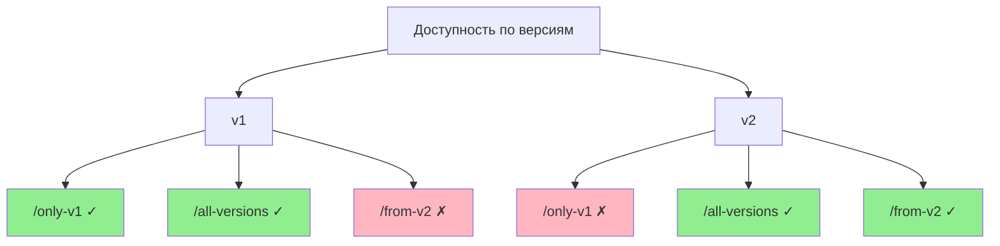

# FastAPI Easy Versioning


[](https://coveralls.io/github/feodor-ra/fastapi-easy-versioning?branch=master)
[](https://feodor-ra.github.io/fastapi-easy-versioning/)

Библиотека для построения версионированного API на [FastAPI](https://fastapi.tiangolo.com). Каждая версия API — отдельное FastAPI-субприложение, смонтированное под общим приложением. Библиотека автоматически наследует эндпоинты из старых версий в новые и перестраивает OpenAPI-схему каждой версии, поэтому `/docs` каждой версии всегда показывает её полный актуальный состав.

## Возможности

- Наследование эндпоинтов между версиями: эндпоинт объявляется один раз и доступен во всех последующих версиях.
- Точное управление диапазоном доступности через параметр `until`.
- Переопределение эндпоинта в новой версии затеняет унаследованный — и в рантайме, и в OpenAPI-схеме.
- Поддержка HTTP- и WebSocket-эндпоинтов.
- Чтение метаданных версионирования (`origin`, `until`) прямо в эндпоинте.
- Несколько независимых версионированных API в одном приложении.
- Единственная рантайм-зависимость — `fastapi` (поддерживаются версии от 0.95 до новейших).

## Установка

```bash
pip install fastapi-easy-versioning
```

[PyPI](https://pypi.org/project/fastapi-easy-versioning/)

## Быстрый старт

Версионирование строится из двух частей, которые работают только вместе:

- `VersioningMiddleware` — добавляется в приложение, монтирующее версии;
- `versioning()` — фабрика зависимостей, помечающая эндпоинт как версионированный.

```python
from fastapi import FastAPI, Depends
from fastapi_easy_versioning import VersioningMiddleware, versioning

app = FastAPI()
app_v1 = FastAPI(api_version=1)
app_v2 = FastAPI(api_version=2)

app.mount("/v1", app_v1)
app.mount("/v2", app_v2)
app.add_middleware(VersioningMiddleware)

@app_v1.get('/only-v1', dependencies=[Depends(versioning(until=1))])
def only_v1() -> str:
    return "Я доступен только в версии v1"

@app_v1.get('/all-versions', dependencies=[Depends(versioning())])
def all_versions() -> str:
    return "Я доступен во всех версиях, начиная с v1"

@app_v2.get('/from-v2', dependencies=[Depends(versioning())])
def from_v2() -> str:
    return "Я доступен начиная с версии v2 и во всех последующих"
```


```mermaid
graph TD
    A[Доступность по версиям]
    A --> B[v1]
    A --> C[v2]

    B --> B1["/only-v1 ✓"]
    B --> B2["/all-versions ✓"]
    B --> B3["/from-v2 ✗"]

    C --> C1["/only-v1 ✗"]
    C --> C2["/all-versions ✓"]
    C --> C3["/from-v2 ✓"]

    style B1 fill:#90EE90
    style B2 fill:#90EE90
    style B3 fill:#FFB6C1

    style C1 fill:#FFB6C1
    style C2 fill:#90EE90
    style C3 fill:#90EE90
```

В результате:

- `/v1/only-v1` отвечает, а `/v2/only-v1` возвращает 404 — эндпоинт ограничен `until=1`.
- `/v1/all-versions` и `/v2/all-versions` отвечают оба — эндпоинт объявлен в `v1` и унаследован в `v2`.
- `/v2/from-v2` отвечает, а `/v1/from-v2` возвращает 404 — эндпоинт появился только в `v2`.
- `/v1/docs` и `/v2/docs` показывают ровно те эндпоинты, которые доступны в соответствующей версии.

## Как это работает

1. Каждая версия — субприложение `FastAPI(api_version=N)`, смонтированное под общим приложением: `app.mount("/v1", app_v1)`. `api_version` должен быть целым числом.
2. `VersioningMiddleware` при первом ASGI-событии (запуск сервера или первый запрос) один раз строит наследование: копирует помеченные эндпоинты из старых версий в новые и перестраивает OpenAPI-схему каждой версии.
3. Наследуются только эндпоинты с зависимостью `versioning()`. Эндпоинт без неё остаётся только в той версии, где объявлен.
4. Каждая наследующая версия получает собственную копию роута — изменения одной версии не влияют на другие.

## Разделы документации

- [Зависимость `versioning`](dependency.md) — способы пометки эндпоинтов, семантика `until`, чтение метаданных в эндпоинте.
- [Middleware](middleware.md) — куда добавлять, как работает наследование, OpenAPI, добавление роутов в рантайме, совместимость с версиями FastAPI.
- Примеры: [простое версионирование](examples/simple.md), [несколько независимых API](examples/multiple.md).

---

[](https://github.com/feodor-ra/fastapi-easy-versioning/blob/master/.pre-commit-config.yaml)
[](https://github.com/astral-sh/uv)
[](https://github.com/astral-sh/ruff)
[](https://github.com/astral-sh/ty)
[](https://github.com/feodor-ra/fastapi-easy-versioning/releases)


