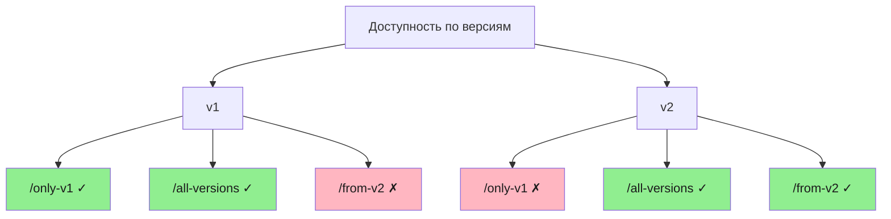

# fastapi-easy-versioning

**Версионированные API на FastAPI.** Одно субприложение на версию, автоматическое наследование эндпоинтов из старых версий в новые и своя актуальная OpenAPI-схема у каждой версии.

---

## Зачем это нужно

Когда API живёт в нескольких версиях, между ними приходится вручную копировать роуты: `/v2` должен отдавать всё, что отдавал `/v1`, кроме того, что осознанно выпилили. Копии расползаются, `/v1/docs` и `/v2/docs` начинают врать, а «в какой версии этот эндпоинт вообще есть» становится вопросом к `git blame`.

`fastapi-easy-versioning` делает диапазон доступности **свойством эндпоинта**: объявляете его один раз, помечаете зависимостью — и он сам оказывается во всех последующих версиях.

=== "Было"

    ```python
    app_v1 = FastAPI()
    app_v2 = FastAPI()


    @app_v1.get("/items")
    def items_v1() -> list[Item]:  # (1)!
        return get_items()


    @app_v2.get("/items")
    def items_v2() -> list[Item]:
        return get_items()
    ```

    1. Один и тот же эндпоинт, продублированный руками. С каждой новой версией копий становится больше, и однажды одну из них забудут обновить.

=== "Стало"

    ```python
    app = FastAPI()
    app.add_middleware(VersioningMiddleware)
    app.mount("/v1", app_v1)
    app.mount("/v2", app_v2)


    @app_v1.get("/items", dependencies=[Depends(versioning())])  # (1)!
    def items() -> list[Item]:
        return get_items()
    ```

    1. Объявлен один раз в v1 — и доступен в v2 и во всех будущих версиях. Схема `/v2/docs` собирается сама.

=== "…с ограничением"

    ```python
    @app_v1.get("/legacy", dependencies=[Depends(versioning(until=2))])  # (1)!
    def legacy() -> str:
        return "уйдёт после v2"
    ```

    1. Доступен в v1 и v2, в v3 его уже нет — ни в рантайме, ни в схеме. Подробнее в [семантике `until`](guide/dependency.md#until).

Каждая версия остаётся обычным FastAPI-приложением: свой роутинг, свой `/docs`, свои `dependency_overrides`.


```mermaid
graph TD
    A[Доступность по версиям]
    A --> B[v1]
    A --> C[v2]

    B --> B1["/only-v1 ✓"]
    B --> B2["/all-versions ✓"]
    B --> B3["/from-v2 ✗"]

    C --> C1["/only-v1 ✗"]
    C --> C2["/all-versions ✓"]
    C --> C3["/from-v2 ✓"]

    style B1 fill:#90EE90,color:#1b1b1b
    style B2 fill:#90EE90,color:#1b1b1b
    style B3 fill:#FFB6C1,color:#1b1b1b

    style C1 fill:#FFB6C1,color:#1b1b1b
    style C2 fill:#90EE90,color:#1b1b1b
    style C3 fill:#90EE90,color:#1b1b1b
```

## Возможности

<div class="grid cards" markdown>

-   :material-source-branch: **Наследование между версиями**

    ---

    Эндпоинт объявляется один раз и сам оказывается во всех последующих версиях. Каждая версия получает собственную копию роута.

    [:octicons-arrow-right-24: Middleware](guide/middleware.md)

-   :material-ray-end: **Точный диапазон доступности**

    ---

    `until` задаёт последнюю версию, в которой эндпоинт доступен. Без него — «до последней версии», включая ещё не созданные.

    [:octicons-arrow-right-24: Семантика until](guide/dependency.md#until)

-   :material-layers-triple: **Переопределение затеняет**

    ---

    Свой эндпоинт на том же пути в новой версии перекрывает унаследованный — и в рантайме, и в OpenAPI.

    [:octicons-arrow-right-24: Правила наследования](guide/middleware.md#inheritance)

-   :material-file-document-check: **Честный `/docs` у каждой версии**

    ---

    После наследования OpenAPI-схема каждой версии перестраивается, поэтому Swagger показывает ровно её состав.

    [:octicons-arrow-right-24: OpenAPI](guide/middleware.md#openapi)

-   :material-transit-connection-variant: **HTTP и WebSocket**

    ---

    `APIRoute` и `APIWebSocketRoute` версионируются одинаково; метаданные версии читаются прямо в эндпоинте.

    [:octicons-arrow-right-24: Зависимость](guide/dependency.md)

-   :material-set-split: **Несколько независимых API**

    ---

    Public и private API в одном приложении версионируются раздельно — по одному middleware на каждое агрегирующее приложение.

    [:octicons-arrow-right-24: Пример](examples/multiple.md)

</div>

## Установка

=== "uv"

    ```bash
    uv add fastapi-easy-versioning
    ```

=== "pip"

    ```bash
    pip install fastapi-easy-versioning
    ```

!!! info "Требования"

    - Python **3.10+**
    - FastAPI **≥ 0.95** (версии `0.137.0` и `0.137.1` исключены — см. [Ограничения](guide/limitations.md#fastapi))
    - Больше ничего: `fastapi` — единственная рантайм-зависимость

## Дальше

<div class="grid cards" markdown>

-   :material-rocket-launch: **[Быстрый старт](quickstart.md)** — рабочее приложение за минуту.
-   :material-book-open-variant: **[Руководство](guide/dependency.md)** — зависимость, middleware, рецепты, ограничения.
-   :material-code-tags: **[Примеры](examples/simple.md)** — запускаемые приложения из репозитория.
-   :material-api: **[Справочник API](reference/dependency.md)** — сигнатуры из docstrings.

</div>
